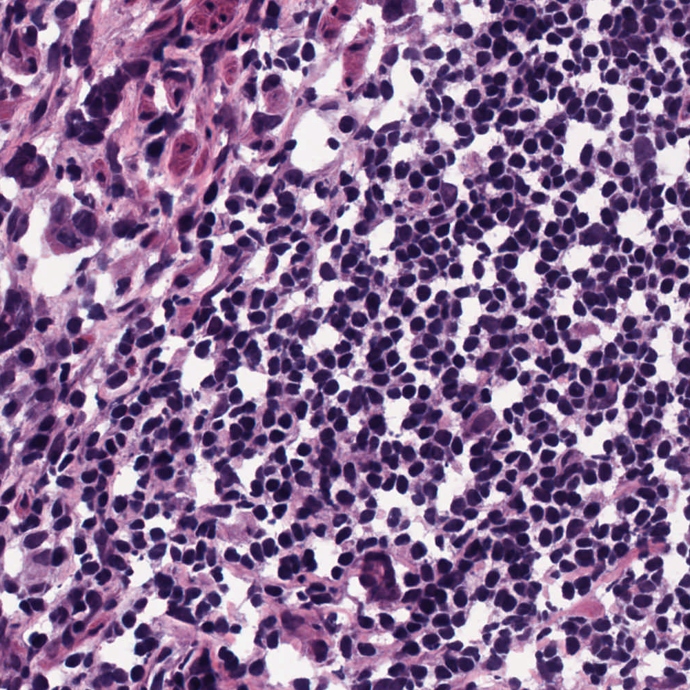
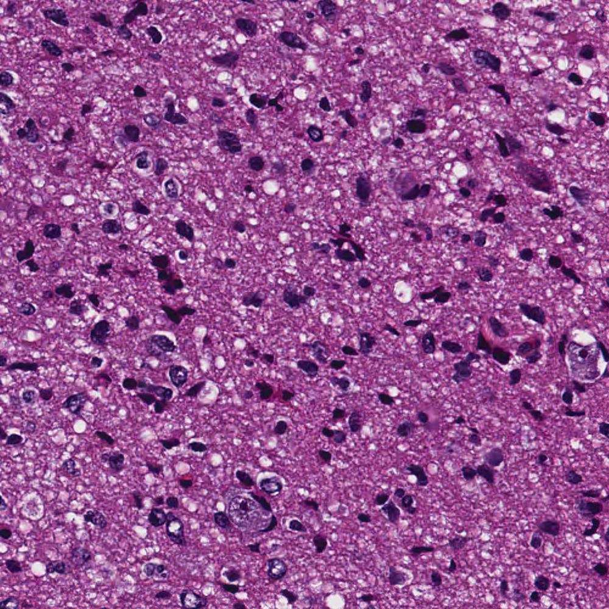
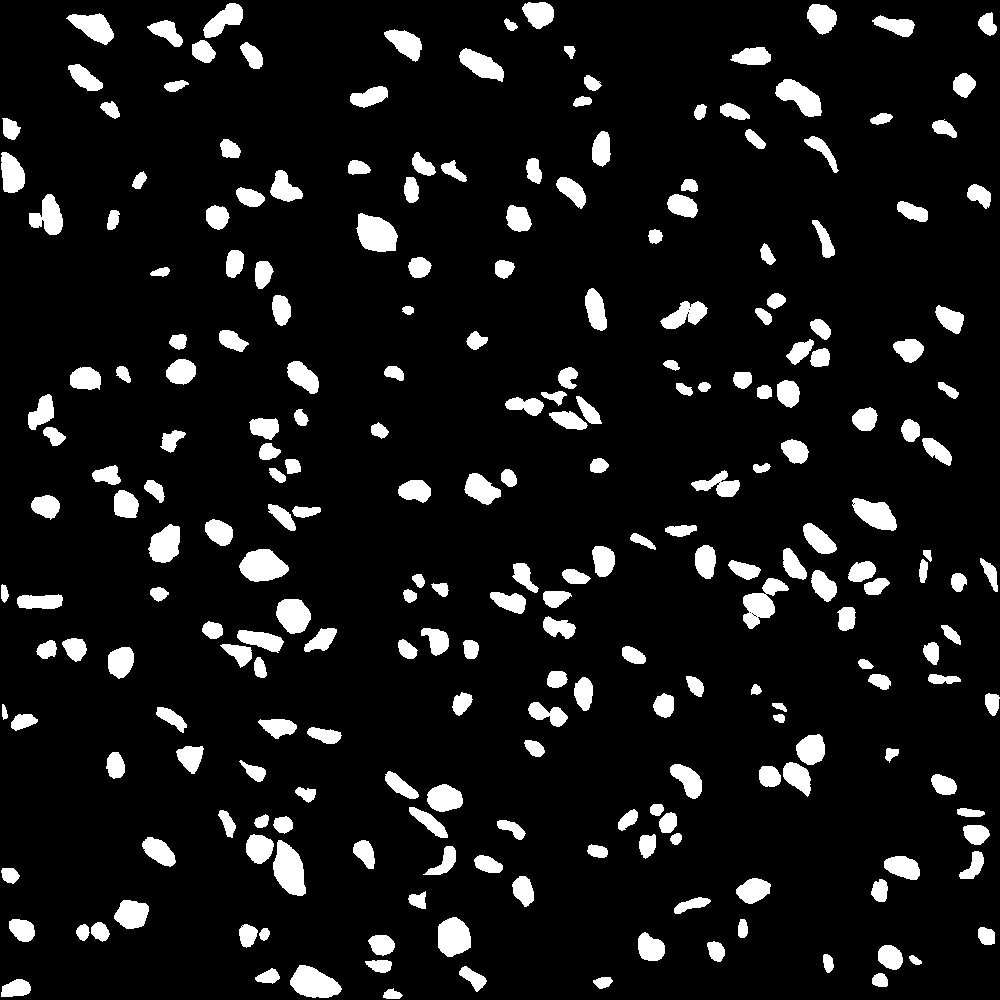
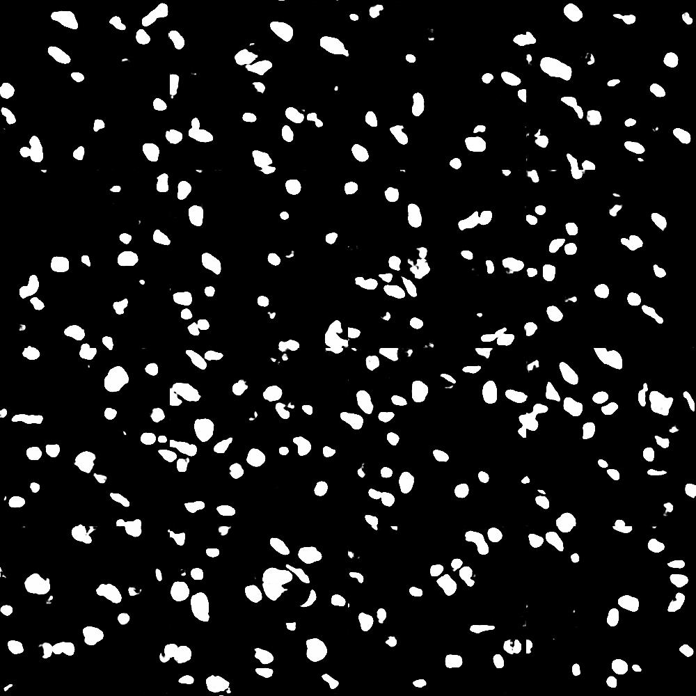

## Repository for [A Multi-organ Nucleus Segmentation Challenge (MoNuSeg)](https://ieeexplore.ieee.org/document/8880654).

<p align="center">Note: If you're interested in using it, feel free to ⭐️ the repo so we know!</p>

### Current Features
- [x] Config File
- [x] Training Graphs
- [x] Patch-Wise Input
- [x] Updation of README Files
- [x] Inference Files
- [x] Quantitative Results
- [x] Visualization of Results
- [x] Train File
- [x] Directory Structure
- [x] Weights Save With Model

Legend
- [x] Resolved
- [ ] Work In-Progess

## Dataset
The dataset for this challenge was obtained by carefully annotating tissue images of several patients with tumors of different organs and who were diagnosed at multiple hospitals. This dataset was created by downloading H&E stained tissue images captured at 40x magnification from TCGA archive. H&E staining is a routine protocol to enhance the contrast of a tissue section and is commonly used for tumor assessment (grading, staging, etc.). Given the diversity of nuclei appearances across multiple organs and patients, and the richness of staining protocols adopted at multiple hospitals, the training datatset will enable the development of robust and generalizable nuclei segmentation techniques that will work right out of the box.

### Training Data
Training data containing 30 images and around 22,000 nuclear boundary annotations has been released to the public previously as a dataset article in IEEE Transactions on Medical imaging in 2017.

### Testing Data
Test set images with additional 7000 nuclear boundary annotations are available here MoNuSeg 2018 Testing data. 

Dataset can be downloaded from [Grand Challenge Webiste](https://monuseg.grand-challenge.org/)

A training sample with segmentation mask from training set can be seen below:
 |      Tissue             | Segmentation Mask (Ground Truth)  |
:-------------------------:|:-------------------------:
  |  

### Patch Generation
Since the size of data set is small and was eaisly loaded into the memmory so we have created patches in online mode. . All the images of training set and test set were reshape to 1024x1024 and then patches were extracted from them. The patch dimensions comprised of **256x256** with 50% overlap among them.

## Models Diagrams

### U-Net Modified
Blocks used to modify U-Net are:
#### Atrous Spatial Pyramid Pooling(ASPP)


#### Squeeze-and-Excitation Network


### SegNet


### U-Net


### Deep Lab v3+


## Pre-Trained Models
The Pre-Trained models can be downloaded from [google drive](https://drive.google.com/file/d/1uTFPece1j-9dUhNvFB3w_FNODzhmx5ql/view).

## Installation
To get this repo work please install all the dependencies using the command below:
```
pip install -r requirments.txt
```

## Training
To start training run the Train.py script from the command below. For training configurations refer to the [config.json](./config.json) file. You can update the file according to your training settings. Model avaible for training are U-NET,SegNet, DeepLabv3+.
```
 python Train.py
```

## Testing
To test the trained models on Test Images you first have to download the weights and place them in the [results](./Results/). After downliading the weights you unzip them and then run the Inference by using the command below. For testing configurations please refer to the [config.json](./config.json) file.
```
python Test.py
```

## Visualization of Results
 |      Tissue             | Mask  |  Predicted Mask  |
:-------------------------:|:-------------------------:|:-------------------------:
  |   |  

## Quantitatvie Results

| Model | Loss | Accuracy | F1 Score | Dice Score |
| ----- | ---- | ---- | ---- | ---- |
| Unet | 0.0835 | 0.915 | 0.7910 | 0.7906 
| Segnet | 0.686 | 0.833 | 0.653 | 0.348
| DeeplabV3+ | 0.0783 | 0.9120 | 0.7750 | 0.7743
| Unet + Skip Connections + ASPP + SE Block | 0.077 |  0.921 | 0.801 | 0.8005

## Results
Three Segmentation models have been trained and the model is evaluated on three metrics namely:
* Accuracy
* F1-Score
* Dice Score
### U-Net + Skip Connections + ASPP
<p float="center">
	
  	
 
  	
</p>

### U-Net
<p float="center">
	
  	
 
  	
</p>

### SegNet
<p float="center">
	
  	
 
  	
</p>

### DeepLab v3
<p float="center">
	
  	
 
  	
</p>

## Author
`Maintainer` [Syed Nauyan Rashid](https://https://github.com/nauyan) (nauyan@hotmail.com)


